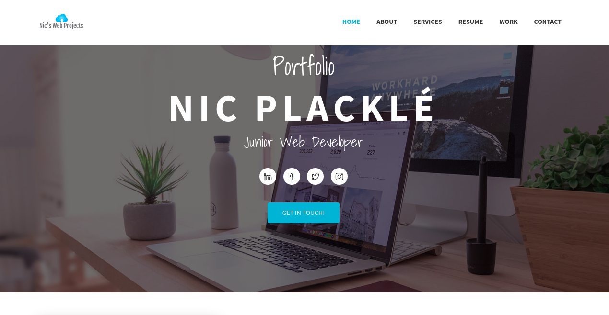

# My-CV-2.0

Check out the live version of my online portfolio [here](https://nicplackle.github.io/My-CV-2.0/ "Portfolio | Nic Placklé | Junior Web Developer").

## Explenation

What you see when you click on the link to the live version is a project I did for my training at Becode.
We were assigned to create an online portfolio including all our info and projects.

## Sections

### About
This section is pretty self-explanatory.  It includes all my contact data.

### Services

This is what I do.  I am still in training to become an experienced web developer, both front- and back-end.  You see what software I have worked with during my training at Becode.  Oh and I also play the guitar, so if you play an instrument and are up for a jam you can get in touch too :)

### Resume

Here you will find my scholar and professional endeavors which I tackled in the past.

### Work

Maybe the most important section of my resume is this one.  This includes some of my projects I did for Becode (screenshot & hyperlink to the actual page).

You will also find 2 websites that I actually didn't create.  One is of my previous job "Muziekhandel Jacky Claes".  I did update the website regularly during my job there.  The other one is from my band "Your Highness".  I am planning to create a new website for my band in the near future as a project.

### Contact

Just in case you missed it in the 'about' section at the top of the page, here you find my contact again.

## Screenshot

